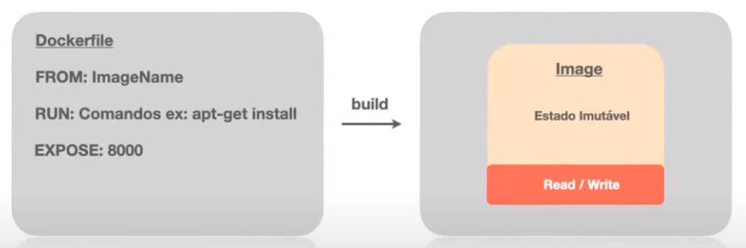

# Install Docker on Linux

- Follow the official documentation to install  [Docker Engine](https://docs.docker.com/engine/install/)

- After that you can install [Docker Desktop](https://docs.docker.com/desktop/install/linux-install/) 
  - Run `sudo apt install ./docker.deb`

This [video](https://youtu.be/Vplj9b0L_1Y) show the previous steps

## How containers are created

For a container to be created an image is needed, you can download existing images from [Docker Hub](https://hub.docker.com/search?q=) or create your own images.

- The images are immutable! You can create versions of your images.

  

  

- To create an image you will need a file called Dockerfile, where you will declare the image name, commands to be executed when creating a new container and define the port to access the container.

## Usage

You can use and configure containers from Docker Desktop or from the command line.

**Commands**

- `docker run image_name` - Create a new container of the selected image, this command includes images from Docker Hub;
  - You can specify ports that reference the port used by the service before creating a new container, ex: `docker run -p 8080:80 nginx` in the browser you can access the nginx server through 8080 port;
  - With **-d** before **-p** you can run the process in background and continue using the terminal tab;
  - With **--name** before **-d** you can name the container, ex: `--name my_nginx_container`.
- `docker start container_name` or `docker start container_id` - start the container;
- `docker stop container_name` or `docker stop container_id` - stop the container;
- `docker rm container_name` or `docker rm container_id` - delete the container, with `rmi` command you can remove images;
- `docker ps` - Shows the containers running;
  -  with **-a** after the command, you can see all existing containers.
- `docker images` - Shows the images that you have;

**Run commands in containers**

- `docker exec container_name command` ex: `docker exec my_nginx_container ls` - List directories in this example;
- `docker exec -it container_name bash` - Access the container's bash to be able to work directly in the container, to exit type `exit` or use `ctrl+d` .

**Dockerfile**

You can create images from a [Dockerfile](https://docs.docker.com/engine/reference/builder/) created in project root folder.

- `docker build -t name_of_image .` - Create a image from a Dockerfile; 

## Docker Compose

Sometimes to run an application, we need more than one container and we need several commands and configurations. To avoid this there is a system we can use called [Docker Compose](https://docs.docker.com/compose/).

To use Docker Compose create a file called `docker-compose.yaml` in the project root folder. In this file the containers used in the application are declared, as well their ports, shared volumes, ...

- `docker-compose up` - Access the docker-compose file and see existing services, then create the necessary containers, use **-d**  command after **up** to run in background;
- `docker-compose down` - Kill the services.

[This video](https://youtu.be/yb2udL9GG2U) was used to learn this content.
